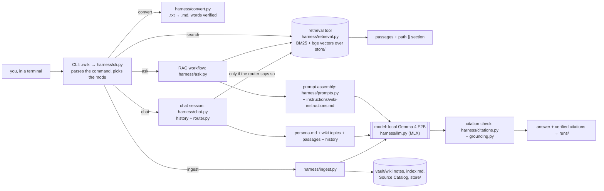
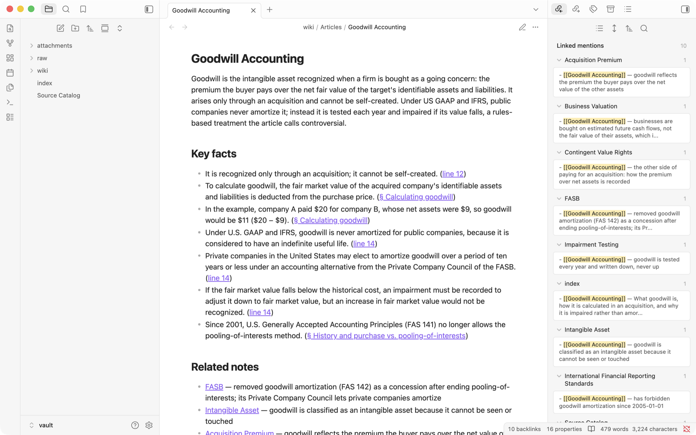
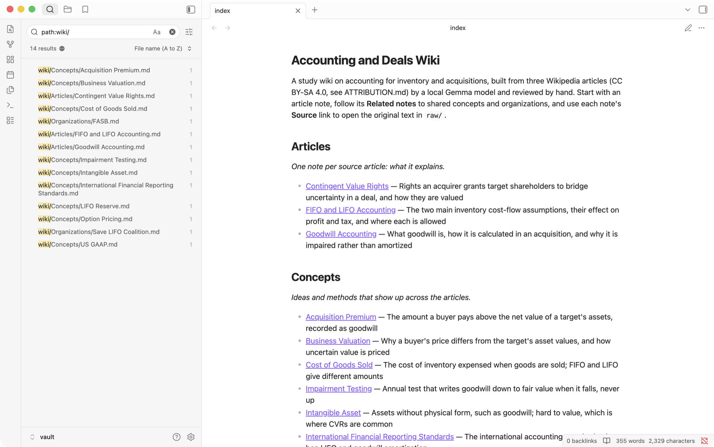
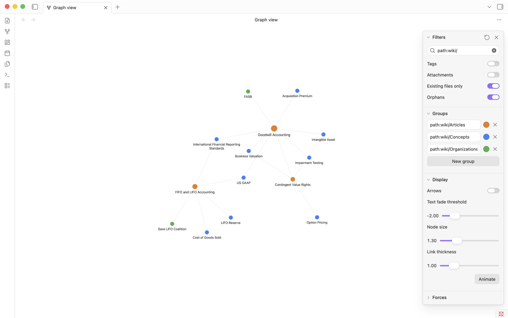
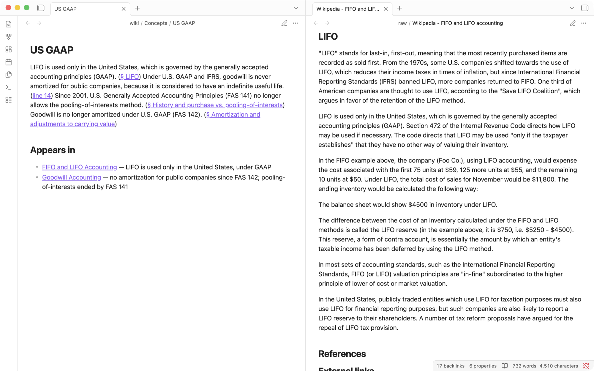

# Personal Wiki with Local Gemma + RAG (Class 5, Assignment 4)

Anthony Brites · From Zero to AI Agents, Fall 26

A command-line study wiki. **Gemma 4 E2B (4-bit) runs locally on my MacBook through MLX**,
and a harness I wrote connects it to a small set of notes. The harness has three modes:

- **`wiki chat`**: a study assistant with a voice ("Marginalia") and memory of the
  conversation. It searches the notes only when a message needs them.
- **`wiki ask`**: standalone factual answers from retrieved evidence, with checked
  citations, or an explicit *insufficient evidence*.
- **`wiki search`**: the original matching passages and their locations. No model, no
  generated answer.

Plus `wiki convert` (plain text → Markdown, with every word verified unchanged),
`wiki ingest` (Gemma drafts linked Obsidian notes), `wiki index`, `wiki status`, and
`wiki --help`. Everything runs with the network off. The [offline run](#evidence) is the
proof. **Nothing is trained or fine-tuned:** Gemma's weights are used exactly as
downloaded, and the notes reach it only as retrieved passages at answer time.

**Start here for grading:**
[four ask-mode evidence cards](#ask-mode-tests-four-questions) ·
[chat/search mode checks](evidence/mode-checks.md) ·
[offline transcript](evidence/offline/transcript.txt) ·
[Obsidian screenshots](#the-wiki-in-obsidian) ·
[harness code](harness/) · [setup](#setup) · [reflection](#reflection-one-real-failure-and-what-id-change)

---

## Contents

1. [Purpose and sources](#purpose-and-sources)
2. [Setup](#setup) · [Commands](#commands)
3. [Device, model choice, and measurements](#device-model-choice-and-measurements)
4. [Architecture: model vs. retrieval vs. RAG vs. harness](#architecture)
5. [Design choices](#design-choices)
6. [The wiki in Obsidian](#the-wiki-in-obsidian)
7. [Evidence](#evidence)
8. [Reflection](#reflection-one-real-failure-and-what-id-change)

---

## Purpose and sources

The wiki is a study aid for accounting around acquisitions: how inventory is costed, what
goodwill is, and how contingent value rights bridge disagreements over price. It should
answer questions like "what was the cost of sales under FIFO in the example?" or "can a
company book goodwill it built itself?". It should also say plainly when the notes don't
cover something.

**Why these sources.** My first choice was my own course materials, but university
policy doesn't allow publishing them. So the sources are three English Wikipedia articles.
Their license, CC BY-SA 4.0, allows this repo to share them with attribution. They were
downloaded once, through the MediaWiki API, pinned to specific revisions
([`ATTRIBUTION.md`](ATTRIBUTION.md), [`tests/sources.json`](tests/sources.json)), and are
kept **unchanged** in [`vault/raw/`](vault/raw/):

| Original (unchanged) | Revision | Words | Markdown copy the harness reads | Wiki note |
|---|---|---|---|---|
| `raw/Wikipedia - FIFO and LIFO accounting.txt` | [1324617022](https://en.wikipedia.org/w/index.php?oldid=1324617022) | 736 | [`.md`](vault/raw/Wikipedia%20-%20FIFO%20and%20LIFO%20accounting.md) | [FIFO and LIFO Accounting](vault/wiki/Articles/FIFO%20and%20LIFO%20Accounting.md) |
| `raw/Wikipedia - Goodwill (accounting).txt` | [1367469269](https://en.wikipedia.org/w/index.php?oldid=1367469269) | 1,288 | [`.md`](vault/raw/Wikipedia%20-%20Goodwill%20(accounting).md) | [Goodwill Accounting](vault/wiki/Articles/Goodwill%20Accounting.md) |
| `raw/Wikipedia - Contingent value rights.txt` | [1369971399](https://en.wikipedia.org/w/index.php?oldid=1369971399) | 410 | [`.md`](vault/raw/Wikipedia%20-%20Contingent%20value%20rights.md) | [Contingent Value Rights](vault/wiki/Articles/Contingent%20Value%20Rights.md) |

**How originals connect to generated pages.**

1. **Convert.** `wiki convert` writes a Markdown copy next to each `.txt`. It turns
   Wikipedia's `== Heading ==` markers into Markdown headings and keeps indented tables
   (like the goodwill journal entry) preformatted. It only writes the copy after checking
   that the word sequence is identical to the original's. The `.txt` hashes recorded at
   download time ([`tests/original-txt-sha256.txt`](tests/original-txt-sha256.txt)) still
   match.
2. **Ingest.** `wiki ingest` gives each article to Gemma and writes **one article note** per
   source into `vault/wiki/Articles/`. It also writes **topic notes** for shared concepts
   and organizations, into `wiki/Concepts/` and `wiki/Organizations/`.
3. **Link.** Every fact links back to the section of the article where the harness found
   it, e.g. `§ LIFO`.
4. **Map.** Each note's frontmatter and the [Source Catalog](vault/Source%20Catalog.md)
   map original file + SHA-256 → Markdown copy → readable note.

I reviewed every generated note against the article and corrected it in the wiki
([`evidence/wiki-review.md`](evidence/wiki-review.md)). The plain-text API drops tables,
so the FIFO article's inventory table is missing, but its totals ($11,050 vs $11,800)
survive in the prose.

---

## Setup

Tested on the device [below](#device-model-choice-and-measurements). Apple Silicon only:
the runtime is MLX. Do these steps once, **while online**; after that nothing needs the
network.

```bash
git clone https://github.com/anthonybrites-cmyk/personal-wiki-class5.git
cd personal-wiki-class5
python3.11 -m venv .venv
.venv/bin/pip install --no-cache-dir -r requirements.txt
```

Download the two models into the local Hugging Face cache (`~/.cache/huggingface/hub`),
pinned to the revisions this project was tested with. The download is about 3.4 GB:

```bash
.venv/bin/hf download mlx-community/gemma-4-e2b-it-4bit --revision 238767527555cb75a05732a84dff5d6ba0dd6809
```

```bash
.venv/bin/hf download mlx-community/bge-small-en-v1.5-4bit --revision 6d66cdf333ff5d4cdad084f2fc2a619575d064ab
```

Check that everything is local:

```bash
./wiki status
```

`status` should show both models as `cached ✓`, 3 source texts, 14 wiki notes, and 61
indexed passages. The retrieval index in `store/` is committed, so `search` works right
away.

**Model source.** Gemma 4 is Google's open-weight model family
([official docs](https://ai.google.dev/gemma/docs/core)). The E2B instruction-tuned
weights are used under the Gemma terms of use. The 4-bit MLX conversion is
[`mlx-community/gemma-4-e2b-it-4bit`](https://huggingface.co/mlx-community/gemma-4-e2b-it-4bit).
Weights are **not** committed to this repo.

Pinned packages ([`requirements.txt`](requirements.txt)): `mlx 0.32.2`, `mlx-vlm 0.7.2`
(Gemma 4 is multimodal, so it loads through mlx-vlm, not mlx-lm), `mlx-embeddings 0.1.0`,
`transformers 5.17.0`, `huggingface_hub 1.32.0`, `numpy 2.4.6`, `pyyaml 6.0.3`.

## Commands

`./wiki` is a small launcher for `.venv/bin/python -m harness`.

| Command | What it does | Uses Gemma? |
|---|---|---|
| `./wiki --help` | commands, configuration, required inputs | no |
| `./wiki status` | model and embedding cache, vault counts, index, instruction files | no |
| `./wiki convert` | writes `NAME.md` next to each `NAME.txt` in `vault/raw/` (encoding, line endings, headings, bullets). Refuses if any word would change. Never modifies the `.txt`. | no |
| `./wiki ingest vault/raw` | converts new `.txt` files, then new or changed sources → Gemma → checked notes; rebuilds `index.md`, the Source Catalog, and the index. Unchanged sources are skipped. `--force` re-runs Gemma anyway. | yes |
| `./wiki index` | rebuild the retrieval index only | no |
| `./wiki search "LIFO reserve"` | original passages + `path § section (lines)`. `-k N`, `--scope sources\|wiki\|all` | **no**, never loaded |
| `./wiki ask "…" --mode local` | standalone RAG answer with checked citations, or *insufficient evidence*. `-k N`, `--quiet` | yes |
| `./wiki chat` | the assistant. Inside: `/notes <q>` forces a search, `/sources`, `/save` (writes a draft to `drafts/`), `/reset`, `/exit` | yes |

`--mode local` is the only mode and the default. I did not build the optional online mode.

Errors are handled plainly:

- Missing weights → exit code 2 with the exact `hf download` command.
- Missing index → "run `wiki index`".
- A non-UTF-8 source → "run `wiki convert`".
- Missing or empty instruction file → names the file.
- No `.venv` → the launcher points to Setup.

Every command saves its output to `runs/` (or `$WIKI_RUNS_DIR`) as JSON plus readable
Markdown.

---

## Device, model choice, and measurements

| | |
|---|---|
| Machine | MacBook Air, **Apple M4** (10-core CPU: 4 performance + 6 efficiency; 8-core GPU, Metal 4) |
| Memory | **16 GB unified** (CPU and GPU share it; no separate VRAM). At the offline run: ⟨OFFLINE:memfree⟩ |
| OS | macOS 26.3.1 (25D2128) |
| Disk | 228 GB SSD, about 15 GB free (this Mac runs nearly full, which ruled out downloading several model sizes) |
| Runtime | Python 3.11.2, MLX 0.32.2 + mlx-vlm 0.7.2 (Metal GPU), mlx-embeddings 0.1.0 |
| Generator | **Gemma 4 E2B-it**, `mlx-community/gemma-4-e2b-it-4bit` @ `2387675`, **4-bit affine quantization, group size 64**. 3.55 GB of weights. 35 layers, 262k vocabulary, 128k context (this harness sends at most ~4k tokens). |
| Embeddings | `mlx-community/bge-small-en-v1.5-4bit` @ `6d66cdf` (384-dim, 19 MB) |
| Decoding | ask/ingest: greedy (temperature 0), so the same evidence gives the same answer. Chat: temperature 0.7. |

**Why E2B at 4-bit.** On 16 GB of unified memory, E2B plus the runtime peaks at about
4.4 GB (MLX's own counter) and about 5 GB for the whole process. That leaves roughly 11 GB
for macOS, Obsidian, and the embeddings. E4B at 4-bit (~4.5 GB just to load, per the Gemma
docs) would probably also fit, but it would roughly double the memory and download on a
disk with ~15 GB free. The 26B MoE (~14.4 GB at Q4) does not fit alongside anything else
on a 16 GB Mac. With the harness's checks, E2B handles all four tests (see below), so it is
the smallest model that works for this wiki. I did not test E4B, so the quality difference
is unmeasured. The [reflection](#reflection-one-real-failure-and-what-id-change) says
where I'd expect it to help.

**Measured on this Mac, offline** (from the
[offline run](evidence/offline/measurements.tsv), using `/usr/bin/time -l`; "peak
footprint" includes GPU memory, which max RSS does not):

| Operation | Wall time | Peak memory footprint | Notes |
|---|---|---|---|
| `wiki ingest vault/raw --force` (3 articles) | ⟨OFFLINE:ingest-time⟩ | ⟨OFFLINE:ingest-mem⟩ | 3 Gemma calls, ~1k–3k prompt tokens each |
| `wiki ask` (one RAG answer, including a ~3.5 s model load) | ⟨OFFLINE:ask-time⟩ | ⟨OFFLINE:ask-mem⟩ | ~1.5k–2k prompt tokens, ~65 tok/s generation |
| `wiki search` (no model) | ⟨OFFLINE:search-time⟩ | ⟨OFFLINE:search-mem⟩ | BM25 + bge vectors |
| `wiki chat` turn | 2–7 s per reply | MLX peak ~4.4 GB | model loaded once per session |

An early version of ingestion reached a **12.4 GB** peak footprint: MLX kept freed GPU
buffers cached between calls. The harness now caps that cache at 1 GB and clears it after
each generation ([`harness/llm.py`](harness/llm.py)).

---

## Architecture



These are five different things, and the code keeps them apart:

- **Model** ([`harness/llm.py`](harness/llm.py)): Gemma 4 E2B only turns the messages it
  is given into text. It does not read files, remember sessions, or call tools. The weights
  are resolved with `local_files_only=True` at a pinned revision, and `HF_HUB_OFFLINE=1` is
  set before anything imports Hugging Face code ([`harness/__init__.py`](harness/__init__.py)).
- **Retrieval tool** ([`harness/retrieval.py`](harness/retrieval.py)): a local index over
  passages from `vault/raw/`. It is BM25 keyword scoring (written in plain Python) fused
  with bge-small cosine similarity by reciprocal-rank fusion. It returns original passages
  with their locations and never calls Gemma. `wiki search` is this tool on its own.
- **RAG workflow** ([`harness/ask.py`](harness/ask.py)): retrieve → put the passages and
  the research rules in a prompt → Gemma → check citations → show and save. RAG supplies
  context at answer time; nothing is trained.
- **Harness**: everything around the model. It covers mode choice, the chat router,
  conversation history, loading the instruction files, prompt assembly, citation checks,
  conversion and ingestion checks, error handling, and saved records.
- **CLI** ([`harness/cli.py`](harness/cli.py) + [`wiki`](wiki)): the terminal interface
  that drives the harness.

### One command, traced through the code

`./wiki ask "In the Foo Co. example, what was the total cost of sales for November under FIFO?"`

1. `wiki` runs `.venv/bin/python -m harness ask …`. `harness/__init__.py` pins Hugging Face
   to offline mode first.
2. `cli.main` parses the arguments and calls `cmd_ask`. `Index.load()` reads
   `store/chunks.jsonl` (61 passages) and `store/embeddings.npy`.
3. `ask.run` calls `index.search(question, k=6)`. BM25 and the bge query vector each rank
   the passages, reciprocal-rank fusion merges them, and at most 3 passages come from any
   one source. A passage with no keyword overlap must reach cosine ≥ 0.45, or it is
   dropped. Result: S1 = the FIFO section with "the total cost of sales for November would
   be $11,050"; S2 = the LIFO section with the $11,800 distractor.
4. `prompts.ask_messages` builds two messages. The system message is
   `instructions/wiki-instructions.md`. The user message is the six passages, labelled
   `[S1] <document> — <path> § <section>`, plus the question. No chat history and no
   persona.
5. `LocalGemma.generate` renders Gemma's chat template and streams tokens with
   `mlx_vlm.stream_generate` at temperature 0. It returns the text plus token counts,
   speed, and peak memory.
6. `citations.check` parses `EVIDENCE:` and `ANSWER:` and runs five checks:
   - **quotes**: each quoted phrase is really in the passage it cites;
   - **claims**: each cited sentence is supported by one of its passages: every number
     appears there, and at least 50% of its words do ([`grounding.py`](harness/grounding.py));
   - **identifiers**: acronyms named in the question appear in a cited passage (spelled
     out counts);
   - **value questions**: a question asking for a specific value gets an answer that
     contains one;
   - **refusals**: refusals worded in the model's own words are recognised.
7. `ask.render` prints the passages, the answer, and the checks. `records.save` writes
   `runs/ask/<time>-<question>.json` and `.md`.

---

## Design choices

**Conversion.** [`harness/convert.py`](harness/convert.py) is deterministic; no model is
involved. It tries UTF-8, then MacRoman (classic Mac exports), then Windows-1252. It then
does the following:

- Normalises line endings.
- Turns the first line into `#` and `== Heading ==` markers into `##`/`###`.
- Keeps indented tables in a fenced block.
- Converts Word-outline bullets into lists.

The gate: `words(original) == words(markdown)`, or nothing is written. It caught one of my
own bugs, where a code-fence label added the word "text".

**Passages.** Chunking follows the Markdown headings: a passage never spans two sections.
Blocks separated by blank lines are packed up to about **170 words**, with a hard limit of
240. A single long paragraph is split between sentences. Fragments under 8 words are
dropped. The three articles give **27 passages**, plus 34 from the generated wiki notes
(61 total). The index text of each passage starts with its document title and heading
path.

**How much text Gemma sees.**

- *ask*: the top 6 passages, about 1.5k–2k prompt tokens.
- *chat*: the top 4 passages for the turn plus up to 8 kept from earlier turns, so
  follow-ups can still cite them, plus the last 12 messages.
- *ingest*: the article's heading outline plus an excerpt capped at 2,200 words, split
  evenly across sections.

Nothing ever sends the whole wiki.

**Retrieval method.**

- BM25 catches exact names and numbers ("Foo Co.", "$11,050", "FAS 142").
- The embeddings catch reworded questions. Test 2 asks about "customer loyalty it built up
  by itself … on its books" and still retrieves "it cannot be self-created".
- Rank fusion avoids having to tune scales between the two scorers.
- A cap of 3 passages per source keeps a two-article question from being filled by one
  article.

**Evidence vs. generated text.** Ask and chat retrieve only from the source texts in
`vault/raw/`. The generated wiki notes are indexed separately, as `kind=wiki`, for
`wiki search --scope wiki`. They are navigation and summary, not evidence. The same goes
for chat drafts saved with `/save` (to `drafts/`, outside the vault) and for chat history.
Ask never reads any of them.

**Research rules vs. personality.** These are two separate files, and each mode loads only
its own:

- [`instructions/wiki-instructions.md`](instructions/wiki-instructions.md) (ask) is a
  neutral voice. It says: use only the passages, **copy the evidence phrases first, then
  answer**, cite `[S#]` after each claim, and reply `INSUFFICIENT EVIDENCE` when the
  passages don't answer.
- [`instructions/persona.md`](instructions/persona.md) (chat) is *Marginalia*, a study
  assistant: warm, concise, speaks to me as "you". It describes what it can and cannot
  actually do and lists the commands. It cites note facts, labels its own ideas
  "Suggestion:", never invents facts or numbers, and treats what I say in chat as
  conversation, not sources.

**When chat retrieves.** [`harness/router.py`](harness/router.py) is rule-based on
purpose, and it prints its decision every turn:

1. Follow-up edits ("make that shorter") → use the conversation, **no search**.
2. Small talk and capability questions ("what can we do?") → **no search**.
3. The message names a wiki note, by title or alias (e.g. "goodwill", "LIFO", "CVR",
   "IFRS") → **search only the source files behind that note**.
4. The message asks about my own notes ("my notes", "according to") → search everything.
5. Otherwise it is general brainstorming → **no search**. `/notes <q>` forces a search.

If a turn retrieved passages but the reply cites none of them, the harness says so. If a
reply cites a label that was never retrieved, the harness flags it as unsupported.

**Note naming and folders.**

- Notes are named for their subject: "Goodwill Accounting", "US GAAP".
- The H1 matches the filename. Machine names ("Wikipedia - Goodwill (accounting)") stay on
  the raw files.
- The harness rejects dates, hashes, underscores, chunk or task IDs, file extensions,
  shell commands, and sentences, and it flags document-type words for review.
- Folders: `wiki/Articles/` (one note per source), `wiki/Concepts/`, and
  `wiki/Organizations/`.
- Machine identity lives in frontmatter: `source`, `source_sha256`, `original`,
  `original_sha256`, `generated_by`, `ingested_at`, `reviewed`.
- `vault/index.md` is the human landing page, grouped by folder with one-line
  descriptions. Code, chunks, embeddings, logs, and test answers all live outside the
  vault.

**Re-ingestion without duplicates.**

- A source's note is found by the `source:` field in its frontmatter, not by filename. The
  lookup ignores case, as macOS does.
- An unchanged source is skipped.
- For a note marked `reviewed: true`, `--force` re-runs Gemma but keeps the reviewed
  prose. It saves Gemma's fresh draft outside the vault for comparison.
- A reviewed note's `concepts:` and `organizations:` lists are the source of truth for its
  links. The reviewer's choice of concept vs organization wins over Gemma's.
- Proof: [`evidence/offline/reingest-check.md`](evidence/offline/reingest-check.md).

**Checks that run during ingestion.** Gemma's draft is parsed from a line format, with
topic lines placed *before* facts so truncation can't remove them. Then it is checked
against the source ([`harness/ingest.py`](harness/ingest.py)):

- Every FACT must be found in a passage of that source (numbers exact, at least 50% of
  words), and is linked to where the harness found it.
- At most 7 facts are kept, one per section first.
- Summary sentences with numbers that are not in the source are dropped.
- Topics must be named in the source.
- Topic summaries are written only from passages of the sources that link to the topic,
  and any sentence without a valid `[S#]` is dropped.

Everything dropped is listed in the ingest report.

---

## The wiki in Obsidian

Open **`vault/`** itself as the Obsidian vault, not the repo. The vault has 3 article
notes, 9 concepts, 2 organizations, `index.md`, and the Source Catalog. All wikilinks
resolve, and every `#heading` link exists
([`evidence/offline/link-check.md`](evidence/offline/link-check.md), from
[`scripts/check_links.py`](scripts/check_links.py)).

| | |
|---|---|
| **An open note** with a readable filename, a matching heading, facts linked to article sections, related notes with the reason for each link, and backlinks  | **Index and page list**: `index.md` grouped by Articles / Concepts / Organizations, with a `path:wiki/` search listing all 14 curated notes and their folders  |
| **Graph view**, filter `path:wiki/`, Attachments off, colour groups Articles (orange), Concepts (blue), Organizations (green). *US GAAP* and *IFRS* link the inventory and goodwill articles. *Business Valuation* and *Intangible Asset* link goodwill and CVRs.  | **Trace to evidence**: the *US GAAP* concept note and its `§ LIFO` link, opened on the unchanged article text: "LIFO is used only in the United States, which is governed by … GAAP"  |

The [Source Catalog](evidence/screenshots/obsidian-source-catalog.png) maps each original
file and its hash to its Markdown copy and its note.

A walk-through: `index.md` → **Goodwill Accounting** → *Related notes* → **US GAAP** →
`§ LIFO` → the original article, or → **FIFO and LIFO Accounting** by the link in *Appears
in*. The graph settings live in
[`vault/.obsidian/graph.json`](vault/.obsidian/graph.json).

---

## Evidence

All graded runs happened **with Wi-Fi off**, in one scripted session:
[`scripts/offline_demo.sh`](scripts/offline_demo.sh) waits until the network is down, then
starts a new `./wiki` process for each step.

- [`evidence/offline/transcript.txt`](evidence/offline/transcript.txt): the full terminal
  transcript, from the air-gap checks at the start and end through help, status,
  conversion (with the original-hash check), ingest, link check, search, the 4 ask tests,
  the chat checks, and ask-after-chat.
  [`terminal.typescript`](evidence/offline/terminal.typescript) is the same session
  recorded by `script(1)`, with colours.
- [`evidence/offline/runs/`](evidence/offline/runs/): every saved record from that run.
- ⟨OFFLINE:screenshots⟩

### Ask-mode tests (four questions)

The questions and their expected evidence were written **before** retrieval ran on these
sources ([`tests/ask-tests.md`](tests/ask-tests.md), commit `f902221`). They live outside
the vault, so the harness never sees the answer key.

| Test | Question | Expected | Retrieval | Answer | Citation check | Card |
|---|---|---|---|---|---|---|
| 1 direct | In the Foo Co. example, what was the total cost of sales for November under FIFO? | $11,050 (distractor: LIFO $11,800) | ⟨OFFLINE:t1r⟩ | ⟨OFFLINE:t1a⟩ | ⟨OFFLINE:t1c⟩ | [test-1](evidence/ask/test-1.md) |
| 2 reworded | Can a company count the customer loyalty it built up by itself as something it owns on its books? | No: goodwill arises only through an acquisition | ⟨OFFLINE:t2r⟩ | ⟨OFFLINE:t2a⟩ | ⟨OFFLINE:t2c⟩ | [test-2](evidence/ask/test-2.md) |
| 3 two sources | What does goodwill represent in an acquisition, and which kind of contingent value right protects the buyer against overpaying? | premium over net assets; event-driven CVRs | ⟨OFFLINE:t3r⟩ | ⟨OFFLINE:t3a⟩ | ⟨OFFLINE:t3c⟩ | [test-3](evidence/ask/test-3.md) |
| 4 unanswerable | What discount rate must companies use when testing goodwill for impairment? | insufficient evidence (no rate given) | ⟨OFFLINE:t4r⟩ | ⟨OFFLINE:t4a⟩ | ⟨OFFLINE:t4c⟩ | [test-4](evidence/ask/test-4.md) |

⟨OFFLINE:testsummary⟩ Each card has the expectation, every retrieved passage in full (the
expected ones are marked), Gemma's verbatim answer, the automatic checks, timing and
memory, and my own assessment after opening the cited passages.

### Chat and search mode checks

[`evidence/mode-checks.md`](evidence/mode-checks.md) covers:

- "what can we do?" and "what can you help me with?" (capabilities, no search)
- a study plan for goodwill accounting, then "make that shorter" (a follow-up from the
  conversation)
- a raw search with no generated answer
- a false claim made only in chat ("my professor told me LIFO is allowed under IFRS"), after
  which a fresh `wiki ask "Is LIFO allowed under IFRS?"` answers from the source, not the
  claim

⟨OFFLINE:modesummary⟩

### Development history (kept, not hidden)

- [`evidence/wiki-review.md`](evidence/wiki-review.md): every correction I made to
  Gemma's notes, and why.
- [`evidence/ingest-history/v1-report.md`](evidence/ingest-history/v1-report.md): Gemma's
  raw ingest output before review.
- [`evidence/prompt-history/`](evidence/prompt-history/): the rehearsal where test 4
  failed, the LLM "relevance judge" I tried and rejected, and the rule that replaced it.
  These runs were online and are labelled that way.
- [`evidence/reingest-check.md`](evidence/reingest-check.md): the first re-ingest check
  (online), before the offline one.

---

## Reflection: one real failure, and what I'd change

⟨OFFLINE:reflection⟩

---

<sub>Repository layout: [`harness/`](harness/) the harness (~2.7k lines of Python) ·
[`instructions/`](instructions/) the prompts each mode loads · [`vault/`](vault/) the
Obsidian vault (`raw/` originals and their Markdown copies, `wiki/` notes, `index.md`) ·
[`store/`](store/) chunks, embeddings, and catalog (machine files, outside the vault) ·
[`tests/`](tests/) the pre-registered questions, source metadata, and original hashes ·
[`scripts/`](scripts/) the offline demo, re-ingest and link checks, and the evidence
builder · [`evidence/`](evidence/) everything above · [`ATTRIBUTION.md`](ATTRIBUTION.md)
the content license.</sub>
